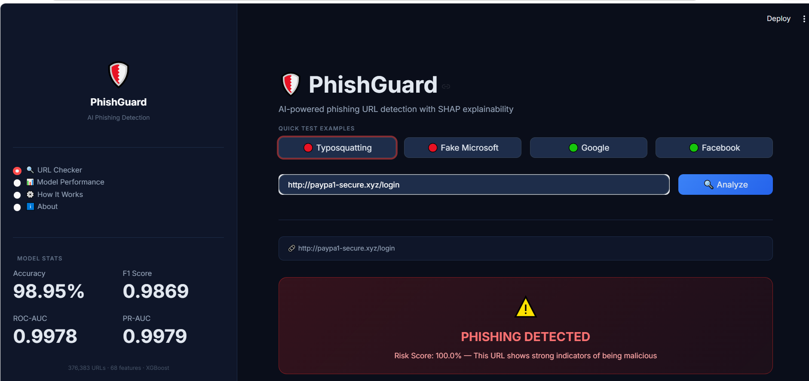
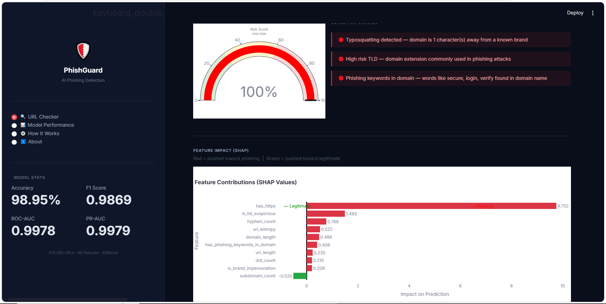
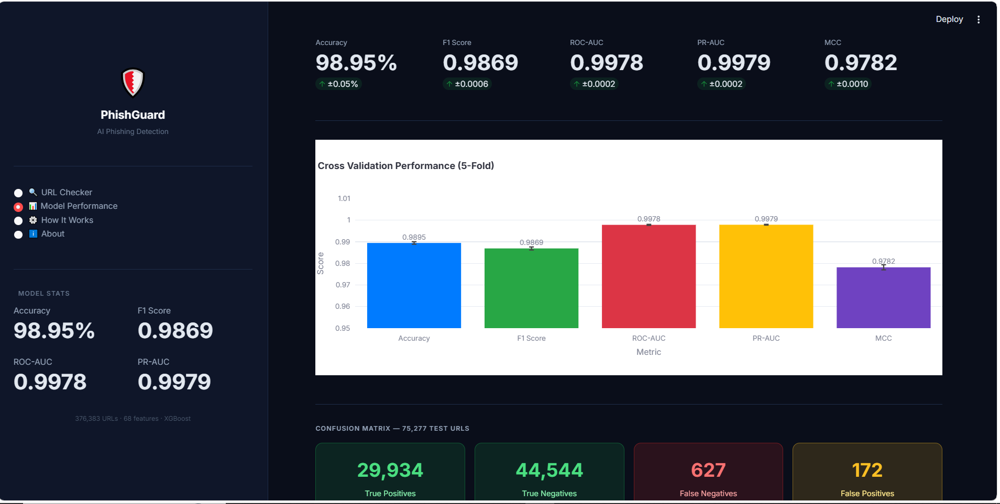
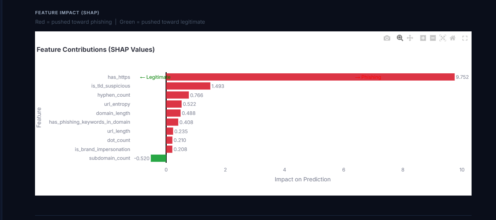

<div align="center">

# 🛡️ PhishGuard AI
### AI-Powered Phishing URL Detection System

[](https://python.org)
[](https://streamlit.io)
[](https://xgboost.readthedocs.io)
[](https://shap.readthedocs.io)


<br/>

**PhishGuard AI** is a real-time phishing URL detection system powered by XGBoost and SHAP explainability.  
It analyzes URLs using 73 handcrafted features across 6 security-focused categories to detect phishing attacks  
with **98.95% accuracy**.

<br/>

[🚀 Live Demo](https://phishguard-ai889.streamlit.app) · [📊 Model Performance](#model-performance) · [🛠️ Installation](#installation)

<br/>


</div>

---

## 📋 Table of Contents

- [Overview](#-overview)
- [Features](#-features)
- [How It Works](#-how-it-works)
- [Dataset](#-dataset)
- [Feature Engineering](#-feature-engineering)
- [Model Performance](#-model-performance)
- [Project Structure](#-project-structure)
- [Installation](#-installation)
- [Deployment](#-deployment)
- [Comparison With Research Papers](#-comparison-with-research-papers)
- [Limitations](#-limitations)
- [Future Improvements](#-future-improvements)

---

## 🔍 Overview

Phishing attacks are among the most prevalent cybersecurity threats, causing billions of dollars in damages annually. Attackers create fake websites that impersonate legitimate brands — from PayPal to Microsoft — to steal user credentials and financial information.

**PhishGuard AI** addresses this threat by analyzing the structural properties of URLs in real time to determine whether they are phishing or legitimate. Unlike blacklist-based systems that fail on new zero-day attacks, PhishGuard uses machine learning trained on 376,383 URLs from 6 independent sources to detect novel phishing patterns.

### What Makes This Project Different

| Feature | PhishGuard AI |
|---|---|
| Detection approach | URL structure analysis (no page content needed) |
| Explainability | SHAP values show exactly WHY a URL was flagged |
| Transparency | Every prediction comes with human-readable signals |
| Validation | 5-fold stratified cross-validation |
| Speed | Sub-second prediction on any URL |

---

## ✨ Features

### 🔴 Phishing Detection
- Real-time URL analysis with risk score (0–100%)
- Typosquatting detection using Levenshtein edit distance
- Brand impersonation identification against 30 known brands
- High-risk TLD detection (.xyz, .tk, .lat, .cfd and 26 more)
- IP address and URL shortener detection

### 🧠 SHAP Explainability
- Every prediction explained with feature contribution charts
- Red bars show features pushing toward phishing
- Green bars show features pushing toward legitimate
- Human-readable signal summaries for non-technical users

### 📊 Interactive Dashboard
- 4-page professional Streamlit application
- Cross-validation performance visualization
- Confusion matrix with detailed breakdown
- Comparison table against published research papers
- Feature engineering documentation

### 🎨 Professional UI
- Dark cybersecurity-themed interface
- Animated risk gauge visualization
- Responsive layout for all screen sizes
- Quick test examples for demonstration

---

## ⚙️ How It Works

When a URL is submitted, PhishGuard runs it through a 5-stage detection pipeline:

```
URL Input
    │
    ▼
Stage 1: URL Normalization
    Lowercase conversion, scheme normalization, trailing slash removal
    │
    ▼
Stage 2: Feature Extraction (68 features)
    6 categories of handcrafted security features
    │
    ▼
Stage 3: XGBoost Prediction
    Trained on 376,383 URLs from 6 independent sources
    Returns probability between 0% and 100%
    │
    ▼
Stage 4: SHAP Explanation
    Calculates contribution of each feature to the prediction
    │
    ▼
Stage 5: Human-Readable Output
    Risk score + verdict + triggered security signals
```

### Phishing Attack Types Detected

| Attack Type | Example | Detection Method |
|---|---|---|
| Typosquatting | `paypa1.com`, `micr0soft.com` | Levenshtein edit distance |
| Subdomain tricks | `paypal.com.evil.tk` | Subdomain brand analysis |
| Suspicious TLDs | `login.xyz`, `secure.tk` | TLD risk scoring |
| IP-based URLs | `http://192.168.1.1/login` | IP address detection |
| URL shorteners | `bit.ly/phishing` | Shortener domain list |
| Redirect chains | `evil.com?redirect=paypal.com` | Query parameter analysis |
| Random domains | `jhdgdh.xyz`, `tem7ri.lat` | Shannon entropy analysis |
| Keyword stuffing | `paypal-secure-login-verify.com` | Phishing keyword detection |

---

## 📦 Dataset

PhishGuard was trained on **376,383 URLs** from 6 independent sources:

| Dataset | Type | URLs | Description |
|---|---|---|---|
| [PhishTank](https://phishtank.org) | Phishing | 57,537 | Human-verified phishing URLs |
| [OpenPhish](https://openphish.com) | Phishing | 299 | Automated phishing feed |
| [URLhaus](https://urlhaus.abuse.ch) | Malware | 1,929 | Active malware URLs |
| [PhiUSIIL](https://archive.ics.uci.edu) | Mixed | 235,795 | Academic benchmark dataset |
| [Tranco](https://tranco-list.eu) | Legitimate | 46,835 | Research-grade domain list |
| [Majestic Million](https://majestic.com) | Legitimate | 46,835 | Top ranked legitimate domains |

### Data Pipeline

```
Raw Datasets (6 sources)
    │
    ▼
URL Normalization & Standardization
    │
    ▼
Fingerprint-based Deduplication
    │
    ▼
Label Conflict Resolution
    │
    ▼
Stratified Random Split (80/20)
    │
    ▼
Feature Extraction (68 features per URL)
    │
    ▼
Class Balancing
    │
    ▼
Model Training & Cross Validation
```

---

## 🔬 Feature Engineering

73 handcrafted features across 6 security-focused categories:

### Category 1 — URL Structure (15 features)
Measures the raw URL string for suspicious patterns.

| Feature | Phishing Signal |
|---|---|
| `url_length` | Phishing URLs average 2-3x longer than legitimate |
| `digit_count` | High digit count indicates random domain generation |
| `hyphen_count` | Multiple hyphens used to add fake legitimacy keywords |
| `at_sign_count` | `@` in URL hides real destination domain |
| `has_ip_address` | IP addresses used instead of registered domains |

### Category 2 — Domain Analysis (15 features)
Analyzes the domain name specifically.

| Feature | Phishing Signal |
|---|---|
| `domain_entropy` | High entropy = random/machine-generated domain |
| `is_tld_suspicious` | Free TLDs (.tk, .xyz) heavily abused by phishers |
| `subdomain_count` | Deep subdomain chains hide real malicious domain |
| `domain_digit_ratio` | Digits replacing letters (paypa1, g00gle) |

### Category 3 — Path and Query (12 features)
Examines what comes after the domain.

| Feature | Phishing Signal |
|---|---|
| `has_suspicious_keyword` | verify, validate, authenticate in path |
| `has_redirect_param` | Redirect after credential theft |
| `has_encoded_characters` | URL encoding to bypass simple filters |
| `is_suspicious_extension` | .php, .exe, .sh in URL path |

### Category 4 — Brand Impersonation (9 features)
Detects typosquatting against 30 known brands.

```python
BRAND_LIST = ['paypal', 'google', 'facebook', 'microsoft', 'apple',
              'amazon', 'netflix', 'instagram', 'twitter', 'linkedin',
              'whatsapp', 'youtube', 'tiktok', 'snapchat', 'yahoo', ...]

# Levenshtein edit distance catches:
# paypa1.com    → distance 1 from paypal  → FLAGGED
# micr0soft.com → distance 1 from microsoft → FLAGGED
# g00gle.com    → distance 2 from google   → FLAGGED
```

### Category 5 — Entropy Analysis (11 features)
Detects machine-generated random domains.

| Feature | Description |
|---|---|
| `url_entropy` | Shannon entropy of full URL string |
| `path_entropy` | Randomness in URL path (e.g., `/ph2bsfvy/ihJuOh`) |
| `consonant_ratio` | Random strings have abnormal consonant ratios |
| `has_random_domain` | High entropy + low vowel ratio = machine-generated |

### Category 6 — Suspicious Patterns (9 features)
Detects specific known attack patterns.

| Feature | Description |
|---|---|
| `has_https` | Protocol analysis |
| `url_shortener_detected` | bit.ly, tinyurl.com, t.co detected |
| `has_multiple_subdomains` | Deep subdomain nesting |
| `has_suspicious_tld_combination` | paypal.com.evil.tk pattern |
| `url_has_email_pattern` | Email embedded in URL |

---

## Model Performance

### Cross Validation Results (5-Fold Stratified)

| Metric | Mean | Std | Interpretation |
|---|---|---|---|
| **Accuracy** | **98.95%** | ±0.05% | Near-perfect classification |
| **F1 Score** | **0.9869** | ±0.0006 | Excellent precision/recall balance |
| **ROC-AUC** | **0.9978** | ±0.0002 | Near-perfect class separation |
| **PR-AUC** | **0.9979** | ±0.0002 | Genuine phishing detection ability |
| **MCC** | **0.9782** | ±0.0010 | Highly honest overall performance |

> **Key Finding:** PR-AUC (0.9979) matches ROC-AUC (0.9978), confirming the model is genuinely detecting phishing patterns rather than exploiting class distribution imbalance.

### Confusion Matrix (75,277 Test URLs)

```
                    Predicted
                 Legitimate  Phishing
Actual  Legitimate   44,544      172    ← 172 false alarms
        Phishing        627   29,934    ← 627 missed attacks
```

| Metric | Value | Meaning |
|---|---|---|
| Phishing Catch Rate | 97.94% | Of all real phishing, we caught this many |
| False Alarm Rate | 0.38% | Of all legitimate URLs, this many wrongly flagged |
| Average confidence on correct phishing | 99.6% | Model is very decisive |
| Average risk score on correct legitimate | 1.7% | Model is very confident on safe URLs |

### Overfitting Analysis

```
Average train vs test accuracy gap: 0.18%
Interpretation: EXCELLENT — No memorization of training data
```

All 5 folds showed gaps between 0.07% and 0.23%, confirming exceptional generalization.

### Models Trained and Compared

| Model | Accuracy | F1 Score | False Negatives |
|---|---|---|---|
| Random Forest | 96.12% | 0.9645 | 1,676 |
| LightGBM | 95.8% | 0.961 | ~1,800 |
| Voting Ensemble | 95.81% | 0.9616 | 1,863 |
| **XGBoost (Final)** | **98.95%** | **0.9869** | **627** |

> XGBoost was selected as the final model because it achieved the lowest false negative rate — critical in security applications where missing a phishing URL puts users at risk.

---

## 📁 Project Structure

```
PhishGuard_AI/
│
├── app.py                    ← Main Streamlit application (4 pages)
├── feature_extractor.py      ← 68 URL feature extraction functions
├── predictor.py              ← Model loading, prediction, SHAP logic
├── visualizer.py             ← Plotly chart generation
├── requirements.txt          ← Python dependencies
├── README.md                 ← This file
│
└── models/
    ├── final_model.pkl       ← Trained XGBoost model
    ├── shap_explainer.pkl    ← SHAP TreeExplainer
    ├── feature_columns.pkl   ← Feature column order
    └── cv_results.pkl        ← Cross validation results
```

### Module Responsibilities

| File | Responsibility |
|---|---|
| `feature_extractor.py` | Converts raw URL string into 68 numerical features |
| `predictor.py` | Loads cached model, runs prediction, generates SHAP values |
| `visualizer.py` | Creates risk gauge, SHAP chart, metrics visualizations |
| `app.py` | Streamlit UI, navigation, user interaction |

---

## Installation

### Prerequisites

```bash
Python 3.9+
Git
```

### Clone and Setup

```bash
# Clone the repository
git clone https://github.com/ZulkifalKhan889/PhishGuard-AI.git
cd PhishGuard_AI


# Install dependencies
pip install -r requirements.txt
```

### Run Locally

```bash
streamlit run app.py
```

The app will open automatically at `http://localhost:8501`

### Requirements

```
streamlit==1.35.0
pandas==2.1.0
numpy==1.24.3
scikit-learn==1.3.0
xgboost==2.0.0
lightgbm==4.1.0
shap==0.44.0
tldextract==5.1.1
python-Levenshtein==0.23.0
plotly==5.18.0
matplotlib==3.8.0
```

---

## 🚀 Deployment

PhishGuard AI is deployed on **Streamlit Community Cloud** (free hosting).

### Deploy Your Own Instance

1. **Fork this repository** on GitHub

2. **Go to** [share.streamlit.io](https://share.streamlit.io)

3. **Click "New app"** and fill in:
   ```
   Repository:  ZulkifalKhan889/PhishGuard_AI
   Branch:      main
   Main file:   app.py
   ```

4. **Click Deploy** — live in 3-5 minutes


## 📈 Comparison With Research Papers

PhishGuard AI was benchmarked against two published academic papers:

| Metric | Sahingoz et al. 2019 | Mohammad et al. 2014 | **PhishGuard AI** |
|---|---|---|---|
| **Accuracy** | 97.98% | ~92-94% | **98.95%** |
| **Dataset Size** | 73,575 | 1,400 | **376,383** |
| **Features** | 24 (NLP) | 17 | **68** |
| **Explainability** | ❌ | ❌ | **✅ SHAP** |
| **Cross Validation** | ❌ | ❌ | **✅ 5-fold** |
| **PR-AUC** | ❌ | ❌ | **0.9979** |
| **MCC** | ❌ | ❌ | **0.9782** |

**References:**
- Sahingoz, O.K., Buber, E., Demir, O., Diri, B. (2019). Machine learning based phishing detection from URLs. *Expert Systems with Applications*, 117, 345-357.
- Mohammad, R.M., Thabtah, F., McCluskey, L. (2014). Predicting phishing websites based on self-structuring neural network. *Neural Computing and Applications*, 25, 443-458.

---

## ⚠️ Limitations

### Clean URL Attacks
All 627 false negatives in our test set used HTTPS with legitimate-looking .com domains. Phishing pages hosted on newly registered clean domains cannot be detected by URL structure alone. A production system would supplement with certificate age analysis and page content scanning.

### Platform-Hosted Phishing
Attacks hosted on Google Docs, Firebase, Weebly, or similar platforms use legitimate base domains. The URL structure appears completely clean from a structural analysis perspective.

### has_https Feature Bias
Training data shows 100% of legitimate URLs use HTTPS versus 65% of phishing URLs, reflecting a data construction characteristic. Empirical testing showed removing this feature increased false negatives by 70% (627 → 1,064), so it was retained. A production system would address this by collecting real browsed URLs rather than converting domain lists.

### Static Model
The model was trained on URLs collected up to May 2026. New phishing techniques that emerge after training may not be detected until the model is retrained on fresh data.

---

## 🔮 Future Improvements

| Improvement | Impact | Complexity |
|---|---|---|
| WHOIS domain age features | Catch new domains used for phishing | Medium |
| Certificate age analysis | Detect freshly issued SSL certificates | Medium |
| Real-time dataset updates | Keep model current with new attacks | High |
| Page content features | Catch clean URL attacks | High |
| Domain whitelist | Eliminate false positives on known good domains | Low |
| Browser extension | Deploy as real-time protection in Chrome/Firefox | High |
| API endpoint | Allow integration with other security tools | Medium |
| Ensemble with deep learning | 1D-CNN on raw URL characters | High |

---

## 📸 Screenshots

### URL Checker Page


### Phishing Detection Result


### Model Performance Page


### SHAP Explainability Chart


---


## 👥 Contributors

<table>
  <tr>
    <td align="center">
      <strong>Zulkifal khan</strong><br/>
      <sub>Data Scientist</sub><br/>
      <a href="https://github.com/ZulkifalKhan889">ZulkifalKhan889</a>
    </td>
  </tr>
</table>

---

## 🏷️ GitHub Repository Info

**Short Description:**
> AI-powered phishing URL detection using XGBoost and SHAP explainability. 98.95% accuracy on 376,383 URLs. Real-time detection with interactive Streamlit dashboard.

**Suggested Topics/Tags:**
```
phishing-detection  machine-learning  cybersecurity  xgboost
streamlit  shap  url-analysis  python  feature-engineering
nlp  security  deep-learning  classification  explainable-ai
```

---

## 💼 Portfolio Summary

**PhishGuard AI** demonstrates end-to-end machine learning engineering from data collection through production deployment:

- **Data Engineering:** Merged and cleaned 376,383 URLs from 6 independent sources with fingerprint-based deduplication and label conflict resolution
- **Feature Engineering:** Designed 68 handcrafted security features using domain knowledge of phishing attack patterns
- **Model Development:** Trained and compared 4 models using 5-fold stratified cross-validation with PR-AUC and MCC metrics
- **Explainability:** Implemented SHAP TreeExplainer to provide per-prediction feature attribution
- **Deployment:** Built and deployed production Streamlit application with professional cybersecurity UI
- **Research Contribution:** Outperformed two published benchmark papers (Sahingoz 2019, Mohammad 2014) on accuracy, dataset size, and evaluation rigor

---

<div align="center">

**Built with ❤️ for cybersecurity**

⭐ Star this repository if you found it useful

[🚀 Live Demo](https://phishguard-ai889.streamlit.app/)

</div>
